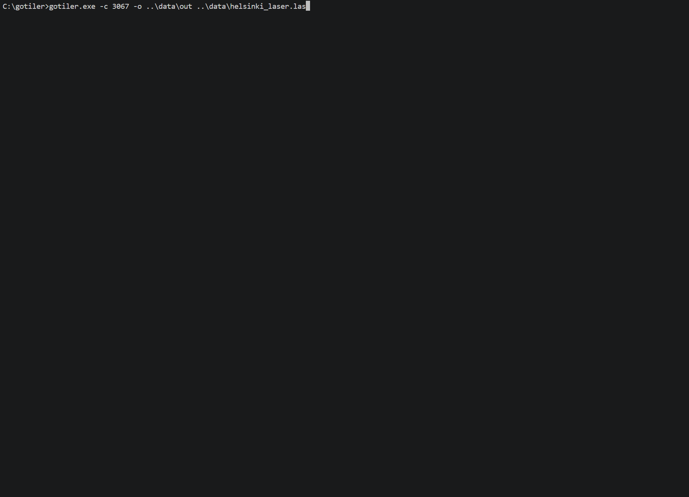

# GoTiler CLI

<p align="center">
  
</p>

**GoTiler CLI** (formerly also known as *gocesiumtiler*) is a **high-performance** tool for turning **point clouds** (LAS, LAZ and E57) into streaming-ready **OGC 3D Tiles** **1.0** and **1.1** formats, ready to use in **CesiumJS** and modern 3D geospatial viewers supporting 3D Tiles.

Powered by an out-of-core tiling engine, on modern hardware backed by fast NVMe storage it leads benchmarks tiling **4M+ points per second** with low memory requirements, processing point clouds with hundreds of millions of points in seconds rather than minutes. The engine lives in this repository too and can be embedded in Go programs: see [LIBRARY.md](LIBRARY.md).

## ❤️ Support the Project

GoTiler is an AGPLv3 open-source project maintained with love. If it saves you time or resources, consider **[making a donation](https://ko-fi.com/mfbonfigli)** to support ongoing maintenance, or starring the repository.

## ✨ Features

### 🚀 Performance & Scale
* **Blazing Fast:** Can process over 4M+ points/sec on modern hardware. Leverages all CPU cores to maximize throughput and squeezes the performances of fast Gen5 NVME drives.
* **Out-of-Core Processing:** Crunch billion-point clouds without blowing up your RAM.
* **Tile Compression:** Leverages `EXT_meshopt_compression` (or the newer `KHR_meshopt_compression`) and `KHR_mesh_quantization` to shrink tile size by 70% or more. **On by default.**
* **Built-in Subsampling:** Optionally thin out massive point clouds on the fly during the tiling process with a single flag.

### 🌐 Formats & GIS Power
* **Native LAS & LAZ Support:** Handles all LAS/LAZ file versions (1.0–1.4) and all point formats with automatic CRS detection from embedded VLRs.
* **E57 Support:** Reads `.e57` point clouds natively (experimental), including scan-prototype extension fields as per-point attributes.
* **Next-Gen 3D Tiles:** Generate tiles following 3D Tiles v1.0 specs (`.pnts`) or v1.1 (`.glb`/glTF).
* **3TZ Archives:** Package each tileset as a single OGC 3D Tiles Archive (`.3tz`) file instead of a folder of loose tiles.
* **Embedded PROJ Reprojection:** Powered by the industry-standard PROJ library for automatic, accurate coordinate transformations with zero-config CRS detection that extracts GeoTIFF/WKT metadata straight from LAS headers.

### 🎨 Colorization
* **Attribute Colorization:** Color points from any numeric attribute or coordinate with automatic percentile stretching.
* **Extended Ramp Library:** 27 additional scientific and cartographic color ramps (see [Color Ramps](#color-ramps)).
* **Advanced Gradient Controls:** Percentile-stretch tuning, discrete banding and color blending modifiers.
* **GeoTIFF Colorization:** Color points on the fly from an RGB/RGBA GeoTIFF orthophoto.

### 🎛️ Tiling Control & Pipeline
* **High-Quality Output:** Automatically partitions clouds into optimized, approximately uniform tiles by number of points.
* **Intuitive Control:** Just set `--points-per-tile` to control the tile size and let the smart algorithm do the heavy lifting of partitioning the cloud in uniform tiles.
* **Customizable:** Optionally fine tune parameters like the geometric error at tiling time to control the rendering behavior.
* **Flexible Refine Modes:** Toggle between `ADD` and `REPLACE` modes to balance network requests against bandwidth.
* **Merge mode:** Read multiple input files and produce a single aggregate 3D Tiles output.

### 💻 User Experience
* **Zero System Dependencies:** One self-contained executable. No external runtime, docker or other tools required.
* **Modern CLI:** Stay informed with real-time progress bars and live speed estimations.

## 📸 Demo



*15.9M points from a thinned [Helsinki dataset](https://doi.org/10.5281/zenodo.5578198) tiled in 3.7 seconds on an Intel Core i5-13600K with a Samsung 980 PRO NVMe SSD. This is just a quick preview: the tool scales to billions of points.*

📸 Preview tilesets generated by GoTiler CLI at [this website](https://d39maarsub1d2t.cloudfront.net/index.html).

## 🏁 Benchmarks

The following table shows the time it took to tile the [Helsinki point cloud](https://zenodo.org/records/5578198) dataset compared with other tools. The cloud has 313M points and is stored in a 13GB LAS file.

| **tool** | **execution time** | **max memory** |
|------|---------------|-----------|
| **gotiler CLI v3.0** | **1m 50s** | **605 MB** |
| [**py3dtiles 12.1.1**](https://gitlab.com/py3dtiles/py3dtiles) | 7m 11s | 2.56 GB |
| [**mago 3d tiler 1.15.4**](https://github.com/Gaia3D/mago-3d-tiler) | 14m 17s | 16.81 GB |

They have been measured on the same AWS EC2 instance `i4i.2xlarge` running Ubuntu linux 24.04. Check out ./scripts/benchmark.sh for how the tests have been run and to reproduce them.

## 💼 Commercial Licensing

GoTiler is released under the GNU AGPLv3. If its terms do not fit your use case, for example to embed the engine in proprietary software or services, commercial licenses are available: please get in touch with the maintainer through [GitHub](https://github.com/mfbonfigli).

## 📣 Installation

Prebuilt binaries for Windows x86_64, Linux x86_64 and Linux ARM64 are provided with each Github release.

1. Download a release archive from the [Releases page](https://github.com/mfbonfigli/gotiler/releases).
2. Unzip it somewhere of your choice. Make sure the executable stays in the same folder as the `share` directory; a symbolic link to the executable from elsewhere, e.g. a folder on your `PATH`, works too.
3. Done

If you need advanced datum grids for high precision coordinate conversion, download them from the PROJ CDN and place them in `share/`.

While processing, gotiler keeps temporary working files in a `tmp` folder inside the output folder, so the output drive needs extra free disk space during execution. The space is released at the end of processing.

### ⚡Quick Start

Tile a single LAS/LAZ/E57 file saving the output into ./out folder:

```bash
gotiler -o ./out ./input.las
```

Tile every point cloud file in a folder into separate tilesets:

```bash
gotiler -o ./out ./las_folder
```

Tile every point cloud file in a folder as one joined tileset, packaged as a single .3tz archive:

```bash
gotiler -o ./out --join --3tz ./las_folder
```

Folders are not scanned recursively: files in subfolders are ignored.

### Commands

| Command | Description |
|---------|-------------|
| `gotiler` | Convert a point cloud file or folder into 3D Tiles. |
| `gotiler version` | Print the gotiler application version. |

### CLI Flags

| Flag | Default | Description |
|---|---:|---|
| `--out`, `-o` | *<required>* | Output folder for generated tilesets. |
| `--crs`, `-c` | *<empty>* (autodetect) | Input CRS, e.g. `EPSG:4326`, `EPSG:28355+5773`, a Proj4 string, or WKT. Bare numbers become EPSG codes. Pass `local` to accept ungeoreferenced input (see [Placing Ungeoreferenced Point Clouds](#placing-ungeoreferenced-point-clouds)). Required for E57 inputs. |
| `--z-offset`, `-z` | `0` | Vertical offset in meters. |
| `--points-per-tile`, `-p` | `50000` | Target points per tile. Must be 5,000 to 5,000,000. |
| `--refine-mode`, `-r` | `add` | Tile refinement mode: `add` or `replace`. |
| `--8-bit` | `false` | Treat LAS/LAZ source colors as 8-bit instead of 16-bit. |
| `--version`, `-v` | `1.1` | 3D Tiles output version: `1.0` (`.pnts`) or `1.1` (`.glb`). |
| `--initial-geometric-error` | `0` | Root geometric error target in meters. `0` derives it from the dataset. |
| `--ge-correction` | `1.0` | Multiplier applied to output geometric errors. |
| `--attributes` | `intensity,classification` | Optional per-point attributes to export: any attribute exposed by the input files (see [Per-Point Attributes](#per-point-attributes)), or `none`. |
| `--colorize` | *<empty>* | Color points from a numeric attribute or local coordinate with `attribute:gradient[:modifier...]`, e.g. `z:viridis` or `intensity:turbo:reverse:steps=8`. See [Colorizing Points](#colorizing-points). |
| `--include-withheld` | `false` | Include points marked as withheld. By default, withheld points are filtered out when the source exposes a `withheld` attribute. |
| `--longitude` | `0` | Only with `--crs local`: longitude (EPSG:4326 degrees) at which to place the model's origin. |
| `--latitude` | `0` | Only with `--crs local`: latitude (EPSG:4326 degrees) at which to place the model's origin. |
| `--height` | `0` | Only with `--crs local`: height in meters relative to the WGS84 ellipsoid at which to place the model's origin. |
| `--heading` | `0` | Only with `--crs local`: rotation in degrees from local north, positive eastward. |
| `--pitch` | `0` | Only with `--crs local`: rotation in degrees from the local east-north plane, positive above. |
| `--roll` | `0` | Only with `--crs local`: rotation in degrees about the local east axis. |
| `--scale`, `-s` | `1` | Only with `--crs local`: uniform scale applied to the model (input units are assumed meters). |
| `--input-up-axis` | `z` | Only with `--crs local`: treats the given axis (`x`, `y` or `z`) as the model's up axis. |
| `--compression` | `meshopt` | Tile compression: `meshopt` compresses GLB tile content with meshoptimizer `EXT_meshopt_compression` + quantization; `none` disables it. Requires tileset version 1.1; `.pnts` (1.0) output is never compressed. See [Tile Compression](#tile-compression). |
| `--meshopt-khr` | `false` | Only with `--compression meshopt`: compress with the Khronos `KHR_meshopt_compression` extension and its version 1 codec instead, for smaller tiles. Needs CesiumJS 1.143 or later. See [Tile Compression](#tile-compression). |
| `--subsample` | `100` | Percentage of points to keep, in (0, 100]. Points are dropped uniformly at random while reading. |
| `--geotiff-colorize` | *<empty>* | Colorize points on the fly from an RGB/RGBA GeoTIFF orthophoto. See [GeoTIFF Colorization](#geotiff-colorization). |
| `--3tz` | `false` | Write each tileset as a single `.3tz` OGC 3D Tiles Archive saved inside the tileset's output folder, instead of loose tiles. See [3TZ Archives](#3tz-archives). |
| `--join`, `-j` | `false` | For folder input, merge all point clouds into one tileset. |
| `--plain` | `false` | Print plain milestone logs instead of progress bars. |
| `--help`, `-h` | | Show help. |

### Refine Mode

- `add`: each point belongs to exactly one level of detail. This reduces output size and bandwidth.
- `replace`: child tiles replace parent tiles and include duplicated higher-level points. This can reduce visible LOD gaps at the cost of larger output.

### Tile Compression

3D Tiles 1.1 (`.glb`) output is compressed by default with `KHR_mesh_quantization` and
`EXT_meshopt_compression`, typically shrinking tilesets by 70% or more with no visible quality
loss. Viewers based on CesiumJS support both extensions out of the box. If your viewer does not,
disable compression with:

```bash
gotiler -o ./out --compression none ./input.las
```

3D Tiles 1.0 (`.pnts`) output has no compressed variant and is always written uncompressed.

`--meshopt-khr` switches to `KHR_meshopt_compression`, the Khronos successor of
`EXT_meshopt_compression`, and its improved version 1 codec, which produces smaller tiles at the
same quality. Viewer support is still limited: CesiumJS added it in version 1.143, and other
engines may not support it yet, so the EXT variant stays the default.

```bash
gotiler -o ./out --meshopt-khr ./input.las
```

### E57 Input

`.e57` files produced by terrestrial laser scanners are read natively (experimental). E57 files
carry no CRS metadata, so `--crs` is required:

```bash
gotiler -o ./out --crs EPSG:32633 ./scan.e57
```

Scans captured in a local frame can be placed on the globe with `--crs local` and the placement
flags, see [Placing Ungeoreferenced Point Clouds](#placing-ungeoreferenced-point-clouds).

Standard E57 fields (intensity, timestamp, normals, invalid flags, row/column indices, ...) and
any extension field declared in the scan prototypes are available to `--attributes`.

### Subsampling

Thin out massive datasets at tiling time by keeping a random percentage of points:

```bash
gotiler -o ./out --subsample 25 ./input.las
```

### 3TZ Archives

`--3tz` packages each tileset as a single OGC 3D Tiles Archive (`.3tz`) saved **inside the
tileset's output folder** (`<out>/tileset.3tz`), replacing the loose tile files. Folder inputs
without `--join` produce one archive per input file, each inside its own output subfolder
(`<out>/<name>/tileset.3tz`).

```bash
gotiler -o ./out --3tz ./input.las
```

### Per-Point Attributes

Per-point attributes are optional scalar values attached to each point alongside its position and color. Only `intensity` and `classification` are exported by default. To explicitly specify the attributes to export use the `--attributes` flag, which accepts **any** attribute exposed by the input files, matched case-insensitively.

Commonly available attributes for LAS/LAZ inputs:

| Attribute name | Type | Description | Included by default |
|---|---|---|---|
| `intensity` | `uint16` | Raw laser return intensity (0–65535) | Yes |
| `classification` | `uint8` | LAS point classification code | Yes |
| `return_number` | `uint8` | Return number within the pulse (1-indexed; 0 = unset) | No |
| `number_of_returns` | `uint8` | Total number of returns for the pulse | No |
| `gps_time` | `float64` | GPS timestamp of the point | No |
| `scan_angle` | `float64` | Scan angle in degrees | No |
| `point_source_id` | `uint16` | File source ID the point originated from | No |
| `user_data` | `uint8` | User data byte | No |
| `classification_flags`, `synthetic`, `key_point`, `withheld`, `overlap` | `uint8` / `bool` | Classification flag bits | No |
| `scan_direction_flag`, `edge_of_flight_line`, `scanner_channel`, `nir`, … | various | Other standard LAS point record fields | No |

In addition, any **extra-byte attribute** declared in the LAS file (e.g. custom sensor fields) can be requested by its declared name; scaled extra bytes are exported as `float64` physical values (`raw*scale+offset`). Common vendor spellings of the same quantity are matched automatically: requesting `incidence_angle` also matches OPALS `_IncidenceAngle` or GeoCue/LP360 `True View Incidence Angle`, and `pulse_width` / `echo_width` match the ASPRS, RIEGL, OPALS (`EchoWidth`) and Terrasolid (`Echo length`) spellings. `Amplitude` and `Reflectance` (RIEGL, OPALS, Terrasolid) match their names directly.

Notes:

- Attributes requested but not found in the source (or missing from some points) are skipped silently.
- Attributes whose data type cannot be represented by the chosen tileset version are omitted from that output: 64-bit integers are not representable in either format, and 3D Tiles 1.1 (`.glb`) stores `float64` attributes (e.g. `gps_time`) as lossy `float32` and drops 32-bit integers. 3D Tiles 1.0 (`.pnts`) preserves `float64` exactly.
- Attribute names appear uppercased in the output tiles (e.g. `INTENSITY`, `GPS_TIME`).
- The dataset-global minimum and maximum of every exported attribute are published in `tileset.json`; see [Tileset Attribute Ranges](#tileset-attribute-ranges).

Pass `none` to suppress all attributes:

```bash
gotiler -o ./out --attributes none ./input.las
```

Pass a comma-separated list to choose which ones to include:

```bash
gotiler -o ./out --attributes intensity,classification,gps_time,my_custom_field ./input.las
```

### Tileset Attribute Ranges

For every exported attribute, the dataset-global minimum and maximum values are
published in `tileset.json`, so viewers can normalize values for shaders and
color gradients without scanning any tile content. How they are exposed depends
on the tileset version.

**3D Tiles 1.1** uses the core tileset metadata mechanism: a metadata `schema`
plus a tileset `metadata` entity with `MIN_`/`MAX_`-prefixed properties, one
pair per exported attribute:

```json
{
  "asset": {"version": "1.1"},
  "schema": {
    "id": "gotiler_dataset",
    "classes": {
      "dataset": {
        "properties": {
          "MIN_INTENSITY": {"type": "SCALAR", "componentType": "UINT16"},
          "MAX_INTENSITY": {"type": "SCALAR", "componentType": "UINT16"}
        }
      }
    }
  },
  "metadata": {
    "class": "dataset",
    "properties": {"MIN_INTENSITY": 12, "MAX_INTENSITY": 833}
  }
}
```

**3D Tiles 1.0** uses the top-level `properties` dictionary, keyed by the
per-point property name:

```json
{
  "asset": {"version": "1.0"},
  "properties": {
    "INTENSITY": {"minimum": 12, "maximum": 833}
  }
}
```

CesiumJS exposes it as `tileset.properties` and uses it automatically to
resolve `${MINIMUM}`-style bounds in declarative styling; in JavaScript read
`tileset.properties.INTENSITY.minimum` / `.maximum`.

Notes:

- Ranges are emitted for every attribute selected with `--attributes` that was
  observed in the data, including attributes whose per-point values the tile
  format cannot carry (e.g. 64-bit integers): the metadata is then the only
  surviving trace of the attribute.
- 3D Tiles 1.1 stores per-point `float64` values (e.g. `gps_time`) as lossy
  `float32`, while the metadata keeps full `float64` precision: clamp when
  normalizing, as rounded per-point values can fall epsilon-outside the range.

### Colorizing Points

Use `--colorize` to overwrite point RGB colors from a numeric attribute or from
the local point coordinates `x`, `y`, or `z`:

```bash
gotiler -o ./out --colorize z:viridis ./input.las
```

The format is `attribute:gradient[:modifier...]`. No bounds are needed: the
gradient is stretched between the 2nd and 98th percentile of the values found
in the data, so outliers and skewed distributions (typical for intensity or
amplitude) do not wash out the ramp. Gradients encoding absolute scales, like
`las-classification`, are applied as is instead of being rescaled. For LAS
classification colors, use:

```bash
gotiler -o ./out --colorize classification:las-classification ./input.las
```

Optional modifiers tweak how the gradient is rendered and can be combined:

| Modifier | Effect |
|----------|--------|
| `reverse` | Reverses the gradient color order. |
| `steps=N` | Quantizes the gradient into N discrete color bands (contour-band look). |
| `stretch=pLow,pHigh` | Sets the percentile stretch (default `2,98`). `stretch=minmax` scales over the full value range. |
| `blend=A` | Blends the gradient with the original point color (`1` = gradient only, `0.5` = even mix). |

```bash
gotiler -o ./out --colorize intensity:turbo:reverse:steps=8:stretch=5,95 ./input.las
```

### Color Ramps

All ramps derive from authoritative, freely licensed sources (matplotlib, seaborn, cmocean, the
Scientific Colour Maps by Fabio Crameri, ColorBrewer); see
[THIRD-PARTY-LICENSES.md](THIRD-PARTY-LICENSES.md) for attributions.

**Perceptually uniform** (best default choices; embedded as canonical 256-entry lookup tables):

| Ramp | Best for |
|---|---|
| `viridis` | General-purpose elevation or continuous density; the scientific standard. |
| `viridis-pastel` | A soft, pastel take on viridis that keeps its perceptual ordering. |
| `magma`, `inferno`, `plasma` | Heat-like sequential data with a dark-to-bright look. |
| `cividis` | Optimized for color-vision deficiency. |
| `turbo` | Vibrant rainbow alternative to "jet" with tuned lightness; great for intensity and edge spotting. |
| `batlow` | Colorblind-safe multi-hue rainbow alternative (Crameri); ideal for canopy-height models. |

**Terrain & elevation**:

| Ramp | Best for |
|---|---|
| `terrain` | Classic land elevation: blue lowlands through green, yellow and brown to white peaks. |
| `gist-earth` | Like terrain with deeper earth tones; pairs well with hillshading. |
| `topo` | Combined bathymetry + land elevation (cmocean); dark depths to bright uplands. |
| `oleron` | Perceptually uniform olive-to-brown ramp for bare-earth DEMs and dryland topography. |
| `nuuk` | Deep indigo to bright mint; crisp accents for urban building heights. |

**Sequential intensity & density** (single direction, dark-to-bright):

| Ramp | Best for |
|---|---|
| `grayscale`, `heat` | Simple built-in defaults. |
| `cubehelix` | Monotonically increasing brightness; stays readable in black-and-white prints. |
| `mako` | Dark navy to light turquoise; deep-water and coastal bathymetric LiDAR. |
| `rocket` | Blackish-purple through reds to pale cream; point-density heat maps. |
| `haline` | Deep blue to bright green (cmocean); brackish water and estuaries. |
| `amp` | Light-to-deep red (cmocean); laser/radar intensity over dark basemaps. |
| `ylgnbu` | ColorBrewer Yellow-Green-Blue; density distributions and drainage. |
| `blues` | ColorBrewer single-hue blue; water depth, subtle underlays. |

**Diverging change detection** (pair with `stretch=minmax` or symmetric data so the
midpoint lands on your baseline):

| Ramp | Best for |
|---|---|
| `rdbu` | The gold standard for change: red = loss/erosion, blue = gain/accumulation. |
| `brbg` | Brown-to-blue-green; bare soil versus vegetation/water shifts. |
| `coolwarm` | Balance-adjusted blue-to-red that tolerates hillshading and shadows. |
| `spectral` | Full-spectrum diverging ramp for deviations from a baseline. |
| `balance` | Perceptually uniform blue-white-red (cmocean) with a truly neutral center. |
| `seismic` | High-contrast deep-blue/white/deep-red; subsurface and elevation differences. |
| `roma` | Crameri diverging scheme tailored to topographic anomalies. |
| `berlin` | Dark-centered diverging map for dark-mode viewers. |
| `piyg` | Pink-to-yellow-green; NDVI-style vegetation anomalies. |

**Categorical classification**:

| Ramp | Best for |
|---|---|
| `las-classification` | ASPRS LAS class codes with their conventional colors (fixed 0–255 scale). |
| `dark2` | Distinct muted dark tones; urban feature separation. |
| `paired` | Light/dark hue pairs; nested classes like low vs. high vegetation. |
| `set2` | Pastel palette that keeps overlaid labels legible. |
| `accent` | Makes selected categories pop against neutral basemaps. |

Categorical ramps map equal-width value bands to discrete colors: combine them with
`stretch=minmax` (or data with a known range) so category codes land on stable bands.
`las-classification` needs nothing extra — it is pinned to the absolute 0–255 class range.

### GeoTIFF Colorization

Color points from an RGB/RGBA GeoTIFF orthophoto instead of a gradient. The orthophoto is sampled
at each point's location, reprojecting on the fly when the CRSs differ:

```bash
gotiler -o ./out --geotiff-colorize ./ortho.tif ./input.las
```

Points falling outside the orthophoto keep their original colors.

### Placing Ungeoreferenced Point Clouds

Input files without a CRS normally fail. Pass `--crs local` to accept them:
the point coordinates are treated as a local Z-up cartesian system in meters
and placed on the WGS84 ellipsoid. By default the model origin `(0,0,0)` lands
on the ellipsoid surface at longitude 0, latitude 0, height 0, axes aligned
east-north-up. Use the placement flags to position and orient the model:

```bash
gotiler -o ./out --crs local \
  --longitude 12.492 --latitude 41.890 --height 76 \
  --heading 45 --scale 1 --input-up-axis y ./scan.las
```

Heading, pitch and roll follow the CesiumJS convention: heading rotates from
local north (positive eastward), pitch tilts from the east-north plane
(positive up), roll rotates about the local east axis. `--input-up-axis y` is
the common choice for glTF/CAD-derived data. Notes:

- The placement flags require `--crs local` and are rejected otherwise.
- Input units are assumed to be meters (after the optional `--scale`).
- The tileset root transform carries the placement, so viewers need nothing special.
- `--geotiff-colorize` works with `--crs local` too, provided the placement positions the cloud at its true geographic location: points falling outside the orthophoto keep their original colors.

### A note on vertical coordinate conversion

If the LAS file contains CRS metadata, gotiler attempts to use it automatically. If metadata is missing, incomplete or incorrect, pass a CRS manually specifying an EPSG code, a composite EPSG code:

```bash
gotiler -o ./out -c EPSG:32633+3855 ./input.las
```

Vertical datum conversions may require additional PROJ grid files in `share/`.

### ℹ️ Usage examples

### Example 1 — Single file, auto-detect CRS

```bash
gotiler -o ./out ./input.las
```

### Example 2 — Folder with custom CRS, output version 3D Tiles 1.0

```bash
gotiler -o ./out -c EPSG:32633+3855 --version 1.0 ./las_folder
```

### Example 3 — Folder merge, REPLACE refine mode, 8-bit colors

```bash
gotiler -o ./out -c EPSG:28355 --join --refine-mode replace --8-bit ./las_folder
```

### Example 4 — Elevation colorized with a stepped batlow ramp

```bash
gotiler -o ./out --colorize z:batlow:steps=12 ./input.las
```

### Example 5 — E57 scan, subsampled to 50%, packaged as a single 3tz archive

```bash
gotiler -o ./out --crs EPSG:32633 --subsample 50 --3tz ./scan.e57
```

### Example 6 — Folder merge with orthophoto colorization and uncompressed output

```bash
gotiler -o ./out --join --geotiff-colorize ./ortho.tif --compression none ./las_folder
```

### Example 7 — Change-detection coloring of a difference attribute over the full range

```bash
gotiler -o ./out --colorize dz:rdbu:stretch=minmax ./diff.las
```

## 📚 Using GoTiler as a Go library

The tiling engine, readers, encoders and plugins are importable Go packages of the
`github.com/mfbonfigli/gotiler/v3` module. See [LIBRARY.md](LIBRARY.md) for the API
and examples, and [DEVELOPMENT.md](DEVELOPMENT.md) for building from source.

## License

GoTiler is distributed under the GNU AGPLv3. See [LICENSE.md](LICENSE.md). For commercial licensing options see [Commercial Licensing](#-commercial-licensing).

The compiled executables contain code and data from third parties: please consult [THIRD-PARTY-LICENSES.md](THIRD-PARTY-LICENSES.md) for their licenses. Each release archive ships the copy generated for its platform.

## Acknowledgments

- [Photorealistic and classified urban point cloud dataset (Helsinki)](https://doi.org/10.5281/zenodo.5578198) by Julin, A., & Rantanen, T. (2021), used for the benchmarks and, thinned, for the demo animation. Licensed under [CC-BY-4.0](https://creativecommons.org).
- The Go gopher mascot was originally designed by Renee French and is licensed under the Creative Commons 4.0 Attribution License.

## Disclaimer

This project is an independent utility and is not affiliated with, sponsored by, or endorsed by Cesium GS, Inc. "Cesium" is a registered trademark of Cesium GS, Inc.
